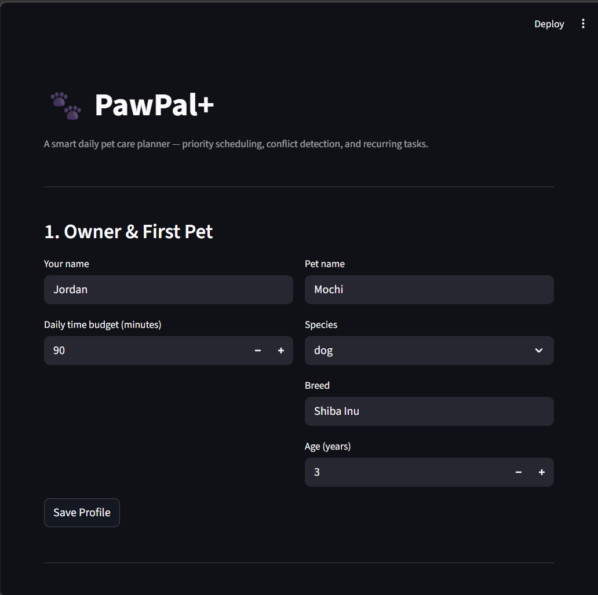

# PawPal+ (Module 2 Project)

**PawPal+** is a Streamlit app that helps a busy pet owner plan daily care tasks for their pet(s) — automatically fitting the most important activities into their available time, detecting scheduling conflicts, and rescheduling recurring tasks like walks and medication.

---

## 📸 Demo

<a href="pawpal_screenshot.png" target="_blank">
  
</a>

---

## Features

### Priority-based scheduling
The scheduler sorts tasks by priority (High → Medium → Low) and greedily fills the owner's daily time budget. Within the same priority level, shorter tasks are scheduled first to maximise the number of tasks completed. High-priority tasks such as medication and feeding are always placed before low-priority enrichment activities.

### Automatic start-time assignment
Once a plan is generated, `Scheduler.assign_start_times()` stamps each task with a sequential `HH:MM` clock time (default start: 08:00), producing a timed daily itinerary — not just a prioritised list.

### Chronological sorting
`Scheduler.sort_by_time()` sorts any task list into chronological order using a lambda key that converts `"HH:MM"` strings to total minutes. This ensures `"09:05"` always sorts before `"10:00"` via integer comparison, never string comparison.

### Conflict detection with inline warnings
`Scheduler.detect_conflicts()` checks every pair of timed tasks for window overlap using the strict interval condition `A.start < B.end AND B.start < A.end`. Conflicts are surfaced in the UI as `st.warning` + `st.error` banners — shown *above* the schedule table so the owner sees the problem before acting on the plan.

### Filter by status or category
`Scheduler.filter_tasks()` lets the owner slice the task list by completion status (`pending` / `done`), by care category (`walk`, `feed`, `meds`, `grooming`, `enrichment`), or both combined. The UI exposes this as a two-dropdown filter panel directly on the task list.

### Recurring tasks with auto-rescheduling
Tasks can be marked `daily` or `weekly`. When `pet.complete_task(task)` is called, Python's `timedelta` calculates the next due date (`+1 day` or `+7 days`) and a fresh copy of the task is automatically appended to the pet's task list — no manual rescheduling needed. Recurring tasks are labelled with a `🔁` icon in the UI.

### Multi-pet support
An `Owner` can manage multiple pets. Each pet has its own independent task list. The `Owner.get_all_tasks()` method aggregates tasks across all pets, and the UI allows per-pet task entry and per-pet schedule generation.

---

## Architecture

Four core classes in `pawpal_system.py`:

| Class | Role |
|---|---|
| `Task` | A single care activity — duration, priority, recurrence, start time |
| `Pet` | Owns a task list; handles task completion and rescheduling |
| `Owner` | Holds the daily time budget; manages multiple pets |
| `Scheduler` | The brain — generates plans, sorts, filters, detects conflicts |

See [`uml_final.png`](uml_final.png) for the final class diagram.

---

## Getting started

### Setup

```bash
python -m venv .venv
source .venv/bin/activate  # Windows: .venv\Scripts\activate
pip install -r requirements.txt
```

### Run the app

```bash
streamlit run app.py
```

### Run the CLI demo

```bash
python main.py
```

---

## Testing PawPal+

### Run the test suite

```bash
python -m pytest
```

Verbose output:

```bash
python -m pytest tests/test_pawpal.py -v
```

### What the tests cover

34 tests across 5 groups in `tests/test_pawpal.py`:

| Group | Tests | What is verified |
|---|---|---|
| `TestGeneratePlan` | 9 | Priority order; budget not exceeded; completed tasks excluded; start times sequential; empty pet; zero budget; exact-fit budget |
| `TestSortByTime` | 4 | Chronological HH:MM order; untimed tasks sort last; empty and single-item lists |
| `TestFilterTasks` | 6 | Filter by status; by category; AND logic; no-match returns empty; no-args passthrough |
| `TestDetectConflicts` | 6 | Overlap flagged; touching edges not a conflict; same start = conflict; single task; no start_time ignored |
| `TestRecurringTasks` | 9 | Daily +1 day; weekly +7 days; new task is incomplete; no start_time; one-time returns None; pet list grows correctly; None due_date defaults to today |

### Confidence level

⭐⭐⭐⭐ **4 / 5**

Core scheduling logic is well covered with happy-path and edge-case tests. One star withheld because:
- No greedy vs. optimal (knapsack) comparison test
- No automated UI integration tests — Streamlit layer is manually verified only
- No multi-pet budget-competition tests

---

## Smarter Scheduling — technical notes

See the [Smarter Scheduling](#smarter-scheduling) section below for implementation details on each algorithm.

### Sort by time
`Scheduler.sort_by_time(tasks)` — lambda converts `"HH:MM"` to int minutes; tasks without a time use a sentinel value (9999) and sort last.

### Filter by status or category
`Scheduler.filter_tasks(tasks, completed=, category=)` — AND-logic filter; both parameters optional.

### Auto-assign start times
`Scheduler.assign_start_times(plan, start_hour=8)` — back-to-back time blocking from a configurable start hour; mutates `task.start_time` in place.

### Conflict detection
`Scheduler.detect_conflicts(tasks)` — interval overlap: `A.start < B.end AND B.start < A.end`; only timed tasks checked.

### Recurring tasks
`Task.next_occurrence()` uses `timedelta(days=1)` or `timedelta(weeks=1)`.
`Pet.complete_task()` calls `task.complete()` and auto-appends the returned next occurrence.
