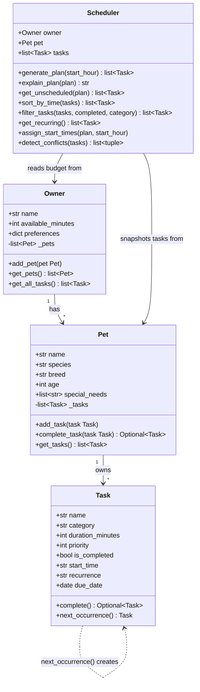

```mermaid
classDiagram

    class Task {
        +str name
        +str category
        +int duration_minutes
        +int priority
        +bool is_completed
        +str start_time
        +str recurrence
        +date due_date
        +complete() Optional~Task~
        +next_occurrence() Task
    }

    class Pet {
        +str name
        +str species
        +str breed
        +int age
        +list~str~ special_needs
        -list~Task~ _tasks
        +add_task(task Task)
        +complete_task(task Task) Optional~Task~
        +get_tasks() list~Task~
    }

    class Owner {
        +str name
        +int available_minutes
        +dict preferences
        -list~Pet~ _pets
        +add_pet(pet Pet)
        +get_pets() list~Pet~
        +get_all_tasks() list~Task~
    }

    class Scheduler {
        +Owner owner
        +Pet pet
        +list~Task~ tasks
        +generate_plan(start_hour) list~Task~
        +explain_plan(plan) str
        +get_unscheduled(plan) list~Task~
        +sort_by_time(tasks) list~Task~
        +filter_tasks(tasks, completed, category) list~Task~
        +get_recurring() list~Task~
        +assign_start_times(plan, start_hour)
        +detect_conflicts(tasks) list~tuple~
    }

    Owner "1" --> "*" Pet : has
    Pet "1" --> "*" Task : owns
    Scheduler --> Owner : reads budget from
    Scheduler --> Pet : snapshots tasks from
    Task ..> Task : next_occurrence() creates
```
